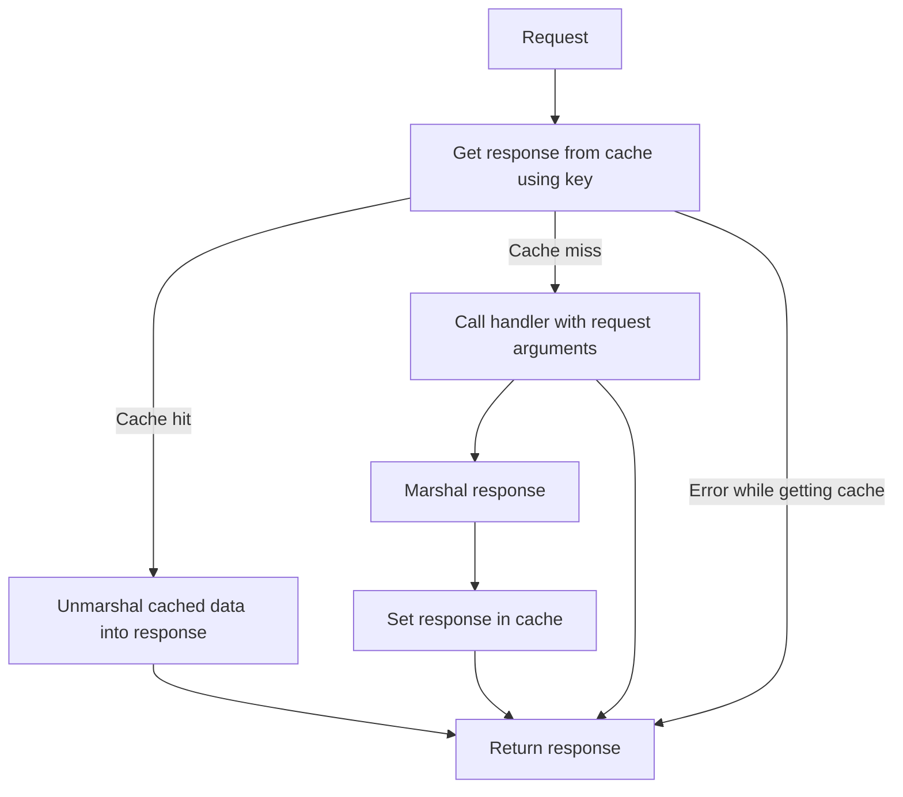

# cache_wrapper

## what？

- 通用缓存实现（基于grpc请求）；
- 缓存错误与异常，避免异常情况数据库穿透；

## how？

### 基本原理



### 如何接入

```bash
go get github.com/SuperJourney/cache_wrapper@v1.0.2
go get github.com/SuperJourney/grpc_formatter@v1.0.0
```

- 初始化 cacheWrapper

```go
// new cacheWrapper
cacheWrapper := cache_wrapper.NewCacheWrapper(cacheengine.NewCacheEngine(), grpcformatter.NewGrpcFormatter(fmt.Sprintf("%s_%s", "MyApp", "Example")), 5)
```

- 设置handle, 按照grpc的 request,response顺序传入

```go
cacheWrapper.SetHandle(func(args ...interface{}) []interface{} {
		resp, err := m.getSubRegisterChannel(args[0].(context.Context), args[1].(*pb_member.DemoRequest))
		return []interface{}{resp, err}
})
```

- 发起请求：

  - ctx: 上下文参数
  - requests []interfaces : 入参
  - response []interfaces : 数据格式化存储知道返回结构体的基本类型， 需要初始化 response;

```go
got, err := cacheWrapper.Request(ctx, []interface{}{ctx, r}, []interface{}{&pb_member.DemoResponse{}, errors.New("")})
if err != nil {
	return nil, err
}
resp, _ := got[0].(*pb_member.DemoResponse)
e, _ := got[1].(error)
return resp, e
```
