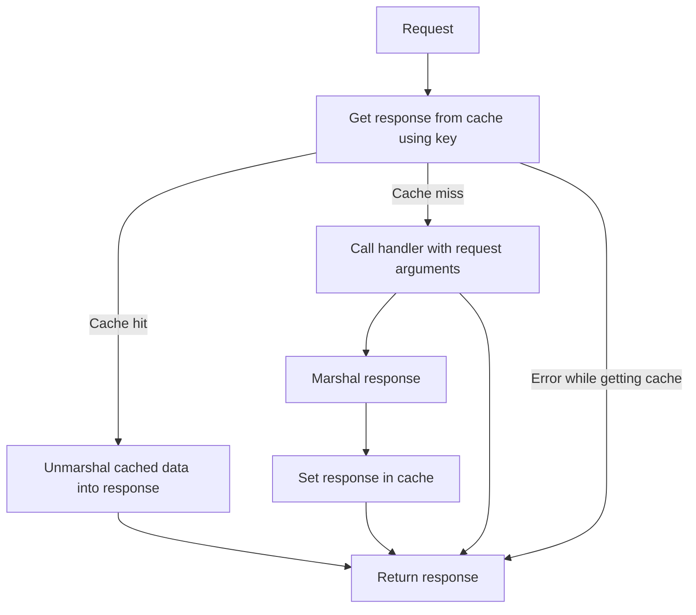

# cache_wrapper

## what？

- 通用缓存实现（基于grpc请求）；
- 缓存错误与异常，避免异常情况数据库穿透；

## how？

### 基本原理

```mermaid

graph TD
A[Request] --> E
E[Get response from cache using key]
E -- Cache hit --> F[Unmarshal cached data into response]
F --> G[Return response]
E -- Cache miss --> H[Call handler with request arguments]
H --> I[Marshal response]
I --> J[Set response in cache]
J --> G[Return response]
E -- Error while getting cache --> G
H --> G[Return response]

```

### 如何接入

`go get github.com/SuperJourney/cache_wrapper@latest `
